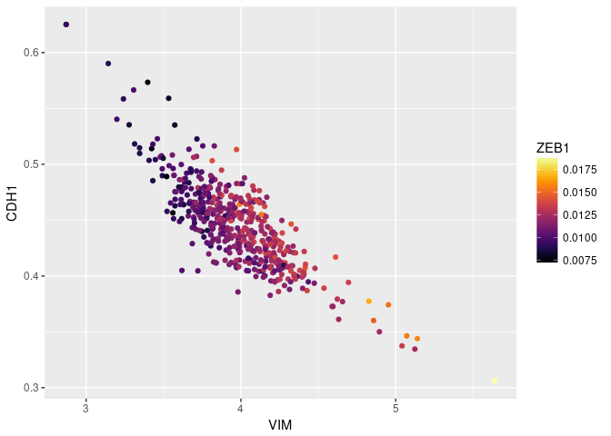
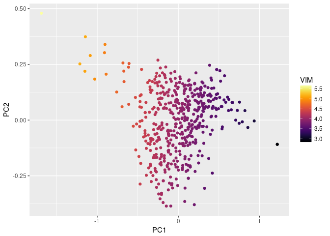
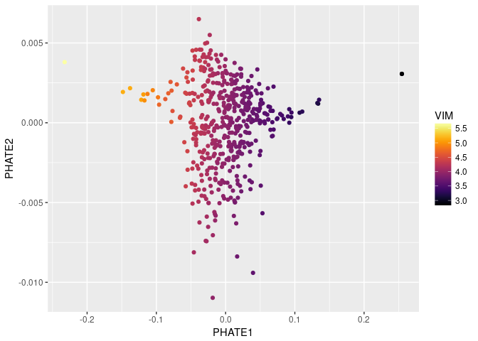

Rmagic v1.0.0
================

<!-- README.md is generated from README.Rmd. Please edit that file -->

[](https://travis-ci.com/KrishnaswamyLab/MAGIC)
[](https://magic.readthedocs.io/)
[](https://doi.org/10.1016/j.cell.2018.05.061)
[](https://twitter.com/KrishnaswamyLab)
[](https://github.com/KrishnaswamyLab/MAGIC/)

Markov Affinity-based Graph Imputation of Cells (MAGIC) is an algorithm
for denoising and transcript recover of single cells applied to
single-cell RNA sequencing data, as described in Van Dijk D *et al.*
(2018), *Recovering Gene Interactions from Single-Cell Data Using Data
Diffusion*, Cell
<https://www.cell.com/cell/abstract/S0092-8674(18)30724-4>.

  - MAGIC imputes missing data values on sparse data sets, restoring the
    structure of the data
  - It also proves dimensionality reduction and gene expression
    visualizations
  - MAGIC can be performed on a variety of datasets
  - Here, we show the usage of MAGIC on a toy dataset

### Installation

To use MAGIC, you will need to install both the R and Python packages.

In R, run these commands to install MAGIC and all dependencies:

``` r
if (!require(devtools)) install.packages(devtools)
if (!require(Rmagic)) devtools::install_github("KrishnaswamyLab/magic/R")
```

In a terminal, run the following command to install the Python
repository.

``` bash
pip install --user git+git://github.com/KrishnaswamyLab/MAGIC.git#subdirectory=python
```

We’ll install a couple more tools for this tutorial.

``` r
if (!require(viridis)) install.packages("viridis")
if (!require(ggplot2)) install.packages("ggplot2")
if (!require(readr)) install.packages("readr")
if (!require(phateR)) install.packages("phateR")
```

If you have never used PHATE, you should also install PHATE from the
command line as follows:

``` bash
pip install --user phate
```

### Loading packages

We load the Rmagic package and a few others for convenience functions.

``` r
library(Rmagic)
#> Loading required package: Matrix
library(ggplot2)
library(readr)
library(viridis)
#> Loading required package: viridisLite
library(phateR)
#> 
#> Attaching package: 'phateR'
#> The following object is masked from 'package:Rmagic':
#> 
#>     library.size.normalize
```

### Loading data

The example data is located in the MAGIC Github repository.

``` r
# load data
data <- read_csv("../data/test_data.csv")
#> Parsed with column specification:
#> cols(
#>   .default = col_double(),
#>   AARSD1 = col_integer(),
#>   AC007773.2 = col_integer(),
#>   AC011998.4 = col_integer(),
#>   AC013470.6 = col_integer(),
#>   AC019129.1 = col_integer(),
#>   AC084357.1 = col_integer(),
#>   ACOT4 = col_integer(),
#>   ADAMTSL1 = col_integer(),
#>   ADGRA2 = col_integer(),
#>   ANKRD36B = col_integer(),
#>   ANKRD36C = col_integer(),
#>   ANP32BP1 = col_integer(),
#>   ANXA2P3 = col_integer(),
#>   ANXA9 = col_integer(),
#>   AP000254.8 = col_integer(),
#>   AP000692.9 = col_integer(),
#>   APLF = col_integer(),
#>   `ATP1A1-AS1` = col_integer(),
#>   ATP5A1P3 = col_integer(),
#>   ATP9B = col_integer()
#>   # ... with 46 more columns
#> )
#> See spec(...) for full column specifications.
data[1:5,1:10]
#> # A tibble: 5 x 10
#>   `A1BG-AS1` AAMDC  AAMP AARSD1 ABCA12 ABCG2 ABHD13 AC007773.2 AC011998.4
#>        <dbl> <dbl> <dbl>  <int>  <dbl> <dbl>  <dbl>      <int>      <int>
#> 1          0     0     0      0      0     0      0          0          0
#> 2          0     1     0      0      0     0      1          0          0
#> 3          1     0     1      0      0     0      0          0          0
#> 4          0     0     0      0      0     0      0          0          0
#> 5          0     0     0      0      0     0      0          0          0
#> # ... with 1 more variable: AC013470.6 <int>
```

### Running MAGIC

Running MAGIC is as simple as running the `magic` function.

``` r
# run MAGIC
data_MAGIC <- magic(data, genes=c("VIM", "CDH1", "ZEB1"))
```

We can plot the data before and after MAGIC to visualize the results.

``` r
ggplot(data) +
  geom_point(aes(VIM, CDH1, colour=ZEB1)) +
  scale_colour_viridis(option="B")
```


The data suffers from dropout to the point that we cannot infer anything
about the gene-gene relationships.

``` r
ggplot(data_MAGIC) +
  geom_point(aes(VIM, CDH1, colour=ZEB1)) +
  scale_colour_viridis(option="B")
```


As you can see, the gene-gene relationships are much clearer after
MAGIC.

The data is sometimes a little too smooth - we can decrease `t` from the
automatic value to reduce the amount of diffusion. We pass the original
result to the argument `init` to avoid recomputing intermediate
steps.

``` r
data_MAGIC <- magic(data, genes=c("VIM", "CDH1", "ZEB1"), t=4, init=data_MAGIC)
ggplot(data_MAGIC) +
  geom_point(aes(VIM, CDH1, colour=ZEB1)) +
  scale_colour_viridis(option="B")
```



We can look at the entire smoothed matrix with `genes='all_genes'`,
passing the original result to the argument `init` to avoid recomputing
intermediate steps. Note that this matrix may be large and could take up
a lot of memory.

``` r
data_MAGIC <- magic(data, genes="all_genes", t=4, init=data_MAGIC)
as.data.frame(data_MAGIC)[1:5, 1:10]
#>     A1BG-AS1      AAMDC      AAMP     AARSD1     ABCA12      ABCG2
#> 1 0.02037769 0.06382652 0.1866998 0.02072613 0.03389173 0.01095330
#> 2 0.02013722 0.06845426 0.1668325 0.01758414 0.02751402 0.01379258
#> 3 0.02339713 0.06700299 0.2123997 0.01443742 0.02607221 0.01715443
#> 4 0.02196478 0.06391724 0.1731796 0.01974522 0.03492706 0.01183354
#> 5 0.02308725 0.06255984 0.1740168 0.01415167 0.03061237 0.01341130
#>       ABHD13   AC007773.2  AC011998.4  AC013470.6
#> 1 0.06269969 0.0003847362 0.001479279 0.002307792
#> 2 0.06077925 0.0005076559 0.001625181 0.001571121
#> 3 0.06778832 0.0016429060 0.001466889 0.004316825
#> 4 0.06394137 0.0002450129 0.000342330 0.001291064
#> 5 0.05982777 0.0011680435 0.002398353 0.003092810
```

### Visualizing MAGIC values on PCA

We can visualize the results of MAGIC on PCA as follows.

``` r
data_MAGIC_PCA <- as.data.frame(prcomp(data_MAGIC)$x)
ggplot(data_MAGIC_PCA) +
  geom_point(aes(x=PC1, y=PC2, color=data_MAGIC$result$VIM)) +
  scale_color_viridis(option="B") +
  labs(color="VIM")
```



### Visualizing MAGIC values on PHATE

We can visualize the results of MAGIC on PHATE as follows. We set `t`
and `k` manually, because this toy dataset is really too small to make
sense with PHATE; however, the default values work well for single-cell
genomic data.

``` r
data_PHATE <- phate(data, k=3, t=15)
ggplot(data_PHATE) +
  geom_point(aes(x=PHATE1, y=PHATE2, color=data_MAGIC$result$VIM)) +
  scale_color_viridis(option="B") +
  labs(color="VIM")
```


