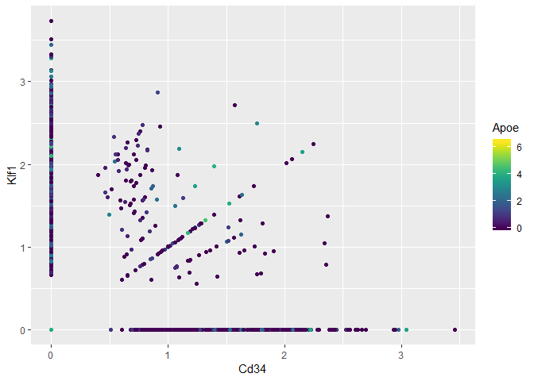
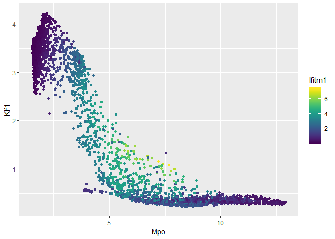
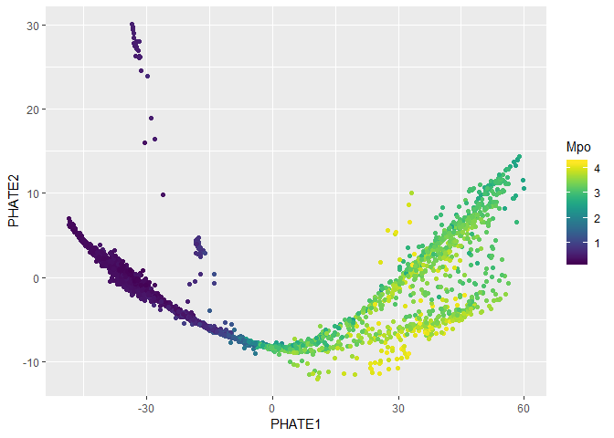

Rmagic Tutorial
================

<!-- README.md is generated from README.Rmd. Please edit that file -->

## MAGIC (Markov Affinity-Based Graph Imputation of Cells)

  - MAGIC imputes missing data values on sparse data sets, restoring the
    structure of the data
  - It also proves dimensionality reduction and gene expression
    visualizations
  - MAGIC can be performed on a variety of datasets
  - Here, we show the effectiveness of MAGIC on
    epithelial-to-mesenchymal transition (EMT) data

To use MAGIC, cite: MAGIC: A diffusion-based imputation method reveals
gene-gene interactions in single-cell RNA-sequencing data Biorxiv
(preprint) February 2017. DOI: doi.org/10.1101/111591

### Installation

In R, run these commands to install MAGIC and all dependencies:

``` r
if (!require(devtools)) install.packages(devtools)
if (!require(Rmagic)) devtools::install_github("KrishnaswamyLab/magic/R")
```

We’ll install a couple more tools for this tutorial.

``` r
if (!require(viridis)) install.packages("viridis")
if (!require(ggplot2)) install.packages("ggplot2")
if (!require(phateR)) install.packages("phateR")
```

If you have never used PHATE, you should also install PHATE from the
command line as follows:

``` bash
pip install --user phate
```

### Running MAGIC

We load the Rmagic package and a few others for convenience functions.

``` r
library(Rmagic)
library(ggplot2)
library(viridis)
```

    ## Warning: package 'viridis' was built under R version 3.4.4

    ## Loading required package: viridisLite

    ## Warning: package 'viridisLite' was built under R version 3.4.4

``` r
library(phateR)
```

    ## Loading required package: Matrix

    ## Warning: package 'Matrix' was built under R version 3.4.4

The example data is located in the MAGIC Github repository.

``` r
# load data
clusters <- read.csv("../../../data/MAP.csv", row.names=NULL, header=FALSE,
                     col.names=c('wells', 'clusters'))
bmmsc <- read.csv("../../../data/BMMC_myeloid.csv.gz", row.names=NULL)
bmmsc <- bmmsc[,2:ncol(bmmsc)]
bmmsc[1:5,1:10]
```

    ##   X0610007C21Rik.Apr3 X0610007L01Rik X0610007P08Rik.Rad26l X0610007P14Rik
    ## 1                   0              0                     0              0
    ## 2                   0              0                     0              1
    ## 3                   0              1                     0              2
    ## 4                   0              1                     0              1
    ## 5                   0              0                     1              0
    ##   X0610007P22Rik X0610008F07Rik X0610009B22Rik X0610009D07Rik
    ## 1              0              0              0              0
    ## 2              0              0              0              0
    ## 3              0              0              0              0
    ## 4              0              0              0              0
    ## 5              0              0              0              1
    ##   X0610009O20Rik X0610010B08Rik.Gm14434.Gm14308
    ## 1              0                              0
    ## 2              0                              0
    ## 3              0                              0
    ## 4              0                              0
    ## 5              3                              0

We should normalize the data prior to running MAGIC. For scRNAseq, it is
always a good idea to library size normalize and then either log or
square root transform the data. Here, we use square root transform.

``` r
bmmsc <- phateR::library.size.normalize(bmmsc)
bmmsc <- sqrt(bmmsc)
```

Running MAGIC is as simple as running the `run_magic` function. We use
`rescale_percent=0.99` to make the output range comparable to the input,
but this is not strictly necessary for downstream analysis.

``` r
# run MAGIC
bmmsc_MAGIC <- run_magic(bmmsc, rescale_percent=0.99)
```

    ## [1] "Library size normalization"
    ## [1] "PCA"
    ## [1] "Computing distances"
    ## [1] "Adapting sigma"
    ## [1] "Symmetrize distances"
    ## [1] "Computing kernel"
    ## [1] "Markov normalization"
    ## [1] "Diffusing"
    ## [1] "Computing optimal t"
    ## ...............
    ***************
    ## [1] "Optimal t = 4"

    ## [1] "Imputing"
    ## [1] "Rescaling"

### Results

We can plot the data before and after MAGIC to visualize the results.

``` r
ggplot(bmmsc) +
  geom_point(aes(Cd34, Klf1, colour=Apoe)) + 
  scale_colour_viridis()
```

<!-- -->

``` r
ggsave('BMMSC_data_R_before_magic.png', width=5, height=5)
```

The data suffers from dropout to the point that we cannot infer anything
about the gene-gene relationships.

``` r
ggplot(bmmsc_MAGIC) +
  geom_point(aes(Mpo, Klf1, colour=Ifitm1)) + 
  scale_colour_viridis()
```

<!-- -->

``` r
ggsave('BMMSC_data_R_after_magic.png', width=5, height=5)
```

As you can see, the gene-gene relationships are much clearer after
MAGIC. These relationships also match the biological progression we
expect to see - Ifitm1 is a stem cell marker, Klf1 is an erythroid
marker, and Mpo is a myeloid marker.

### Visualizing MAGIC values on PHATE

We can visualize the results of MAGIC on PHATE as follows.

``` r
bmmsc_PHATE <- phateR::phate(bmmsc)
ggplot(bmmsc_PHATE) +
  geom_point(aes(x=PHATE1, y=PHATE2, color=bmmsc_MAGIC$Klf1)) +
  scale_color_viridis() +
  labs(color="Mpo")
```

<!-- -->

``` r
ggsave('BMMSC_data_R_phate_colored_by_magic.png', width=5, height=5)
```
