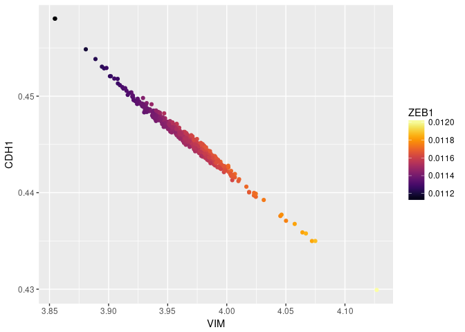
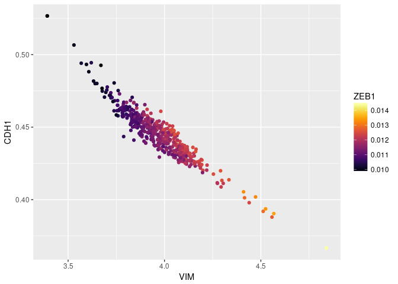
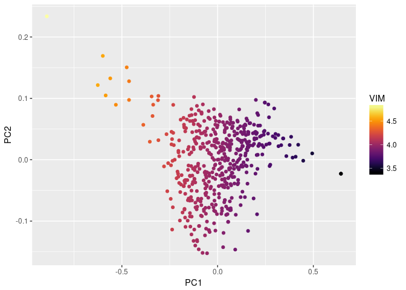

Rmagic v1.0.0
================

<!-- README.md is generated from README.Rmd. Please edit that file -->

[](https://cran.r-project.org/package=Rmagic)
[](https://travis-ci.com/KrishnaswamyLab/MAGIC)
[](https://magic.readthedocs.io/)
[](https://www.cell.com/cell/abstract/S0092-8674(18)30724-4)
[](https://twitter.com/KrishnaswamyLab)
[](https://github.com/KrishnaswamyLab/MAGIC/)

Markov Affinity-based Graph Imputation of Cells (MAGIC) is an algorithm
for denoising and imputation of single cells applied to
single-cell RNA sequencing data, as described in Van Dijk D *et al.*
(2018), *Recovering Gene Interactions from Single-Cell Data Using Data
Diffusion*, Cell
<https://www.cell.com/cell/abstract/S0092-8674(18)30724-4>.

<p align="center">

<br>
<i>Magic reveals the interaction between Vimentin (VIM), Cadherin-1 (CDH1), and Zinc finger E-box-binding homeobox 1 (ZEB1, encoded by colors).
</i>
</p>

  - MAGIC imputes missing data values on sparse data sets, restoring the
    structure of the data
  - It also proves dimensionality reduction and gene expression
    visualizations
  - MAGIC can be performed on a variety of datasets
  - Here, we show the usage of MAGIC on a toy dataset
  - You can view further examples of MAGIC on real data in our notebooks
    under
        `inst/examples`:
      - <http://htmlpreview.github.io/?https://github.com/KrishnaswamyLab/MAGIC/blob/master/Rmagic/inst/examples/EMT_tutorial.html>
      - <http://htmlpreview.github.io/?https://github.com/KrishnaswamyLab/MAGIC/blob/master/Rmagic/inst/examples/bonemarrow_tutorial.html>

### Installation

To use MAGIC, you will need to install both the R and Python packages.

If `python` or `pip` are not installed, you will need to install them. We recommend
[Miniconda3](https://conda.io/miniconda.html) to install Python and `pip` together,
or otherwise you can install `pip` from https://pip.pypa.io/en/stable/installing/.

#### Installation from CRAN

In R, run this command to install MAGIC and all dependencies:

``` r
install.packages("Rmagic")
```

In a terminal, run the following command to install the Python
repository.

``` bash
pip install --user git+git://github.com/KrishnaswamyLab/MAGIC.git#subdirectory=python
```

#### Installaton from source

To install the very latest version of MAGIC, you can install from
GitHub with the following commands run in a terminal.

``` bash
git clone https://github.com/KrishnaswamyLab/MAGIC
cd MAGIC/python
python setup.py install --user
cd ../Rmagic
R CMD INSTALL .
```

#### Extra packages for the tutorial

We’ll install a couple more tools for this tutorial.

``` r
if (!require(viridis)) install.packages("viridis")
if (!require(ggplot2)) install.packages("ggplot2")
if (!require(phateR)) install.packages("phateR")
```

If you have never used PHATE, you should also install PHATE from the
command line as follows:

``` bash
pip install --user phate
```

### Loading packages

We load the Rmagic package and a few others for convenience functions.

``` r
library(Rmagic)
#> Loading required package: Matrix
library(ggplot2)
library(viridis)
#> Loading required package: viridisLite
library(phateR)
#>
#> Attaching package: 'phateR'
#> The following object is masked from 'package:Rmagic':
#>
#>     library.size.normalize
```

### Loading data

The example data is located in the MAGIC Github repository.

``` r
# load data
data(magic_testdata)
magic_testdata[1:5,1:10]
#>       A1BG-AS1     AAMDC      AAMP AARSD1 ABCA12 ABCG2    ABHD13
#> 6564 0.0000000 0.0000000 0.0000000      0      0     0 0.0000000
#> 3835 0.0000000 0.8714711 0.0000000      0      0     0 0.8714711
#> 6318 0.7739207 0.0000000 0.7739207      0      0     0 0.0000000
#> 3284 0.0000000 0.0000000 0.0000000      0      0     0 0.0000000
#> 1171 0.0000000 0.0000000 0.0000000      0      0     0 0.0000000
#>      AC007773.2 AC011998.4 AC013470.6
#> 6564          0          0          0
#> 3835          0          0          0
#> 6318          0          0          0
#> 3284          0          0          0
#> 1171          0          0          0
```

### Running MAGIC

Running MAGIC is as simple as running the `magic` function.

``` r
# run MAGIC
data_MAGIC <- magic(magic_testdata, genes=c("VIM", "CDH1", "ZEB1"))
```

We can plot the data before and after MAGIC to visualize the results.

``` r
ggplot(magic_testdata) +
  geom_point(aes(VIM, CDH1, colour=ZEB1)) +
  scale_colour_viridis(option="B")
```


The data suffers from dropout to the point that we cannot infer anything
about the gene-gene relationships.

``` r
ggplot(data_MAGIC) +
  geom_point(aes(VIM, CDH1, colour=ZEB1)) +
  scale_colour_viridis(option="B")
```



As you can see, the gene-gene relationships are much clearer after
MAGIC.

The data is sometimes a little too smooth - we can decrease `t` from the
automatic value to reduce the amount of diffusion. We pass the original
result to the argument `init` to avoid recomputing intermediate
steps.

``` r
data_MAGIC <- magic(magic_testdata, genes=c("VIM", "CDH1", "ZEB1"), t=6, init=data_MAGIC)
ggplot(data_MAGIC) +
  geom_point(aes(VIM, CDH1, colour=ZEB1)) +
  scale_colour_viridis(option="B")
```



We can look at the entire smoothed matrix with `genes='all_genes'`,
passing the original result to the argument `init` to avoid recomputing
intermediate steps. Note that this matrix may be large and could take up
a lot of
memory.

``` r
data_MAGIC <- magic(magic_testdata, genes="all_genes", t=6, init=data_MAGIC)
as.data.frame(data_MAGIC)[1:5, 1:10]
#>        A1BG-AS1      AAMDC      AAMP     AARSD1     ABCA12      ABCG2
#> 6564 0.02547428 0.06396845 0.1732406 0.01662639 0.03165963 0.01321600
#> 3835 0.02530630 0.06340049 0.1644346 0.01595464 0.02956863 0.01387038
#> 6318 0.02675641 0.06392424 0.1769904 0.01533683 0.03143977 0.01468506
#> 3284 0.02492706 0.06235185 0.1650386 0.01619631 0.02940383 0.01365444
#> 1171 0.02741414 0.06310647 0.1727671 0.01539614 0.03207575 0.01466226
#>          ABHD13   AC007773.2  AC011998.4  AC013470.6
#> 6564 0.07026219 0.0010481534 0.001706211 0.003337107
#> 3835 0.06842053 0.0010290600 0.001740188 0.002713894
#> 6318 0.07229419 0.0012075717 0.002015567 0.004129593
#> 3284 0.06950077 0.0009517399 0.001459601 0.002545323
#> 1171 0.07084005 0.0012504564 0.002197020 0.003821794
```

### Visualizing MAGIC values on PCA

We can visualize the results of MAGIC on PCA as follows.

``` r
data_MAGIC_PCA <- as.data.frame(prcomp(data_MAGIC)$x)
ggplot(data_MAGIC_PCA) +
  geom_point(aes(x=PC1, y=PC2, color=data_MAGIC$result$VIM)) +
  scale_color_viridis(option="B") +
  labs(color="VIM")
```



### Visualizing MAGIC values on PHATE

We can visualize the results of MAGIC on PHATE as follows. We set `t`
and `k` manually, because this toy dataset is really too small to make
sense with PHATE; however, the default values work well for single-cell
genomic data.

``` r
data_PHATE <- phate(magic_testdata, k=3, t=15)
ggplot(data_PHATE) +
  geom_point(aes(x=PHATE1, y=PHATE2, color=data_MAGIC$result$VIM)) +
  scale_color_viridis(option="B") +
  labs(color="VIM")
```


## Help

If you have any questions or require assistance using MAGIC, please contact us at <https://krishnaswamylab.org/get-help>.
