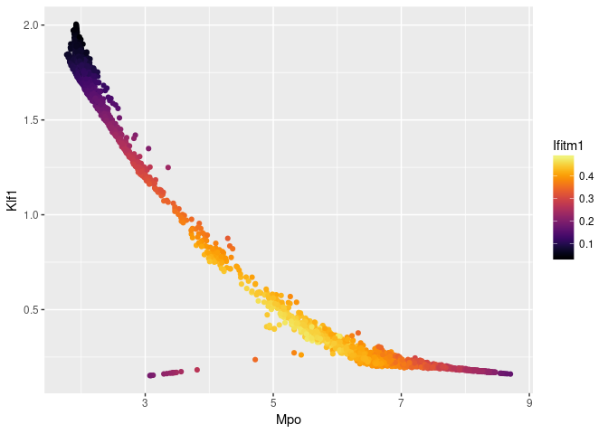
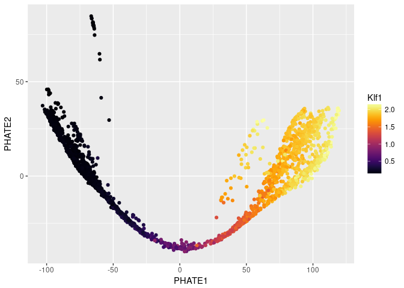

Rmagic Bone Marrow Tutorial
================

<!-- README.md is generated from README.Rmd. Please edit that file -->

## MAGIC (Markov Affinity-Based Graph Imputation of Cells)

  - MAGIC imputes missing data values on sparse data sets, restoring the
    structure of the data
  - It also proves dimensionality reduction and gene expression
    visualizations
  - MAGIC can be performed on a variety of datasets
  - Here, we show the effectiveness of MAGIC on erythroid and myeloid
    cells developing in mouse bone marrow.

Markov Affinity-based Graph Imputation of Cells (MAGIC) is an algorithm
for denoising and transcript recover of single cells applied to
single-cell RNA sequencing data, as described in Van Dijk D *et al.*
(2018), *Recovering Gene Interactions from Single-Cell Data Using Data
Diffusion*, Cell
<https://www.cell.com/cell/abstract/S0092-8674(18)30724-4>.

### Installation

To use MAGIC, you will need to install both the R and Python packages.

In R, run these commands to install MAGIC and all dependencies:

``` r
if (!require(devtools)) install.packages(devtools)
if (!require(Rmagic)) devtools::install_github("KrishnaswamyLab/magic/Rmagic")
```

In a terminal, run the following command to install the Python
repository.

``` bash
pip install --user git+git://github.com/KrishnaswamyLab/MAGIC.git#subdirectory=python
```

We’ll install a couple more tools for this tutorial.

``` r
if (!require(viridis)) install.packages("viridis")
if (!require(ggplot2)) install.packages("ggplot2")
if (!require(readr)) install.packages("readr")
if (!require(phateR)) install.packages("phateR")
```

If you have never used PHATE, you should also install PHATE from the
command line as follows:

``` bash
pip install --user phate
```

### Loading packages

We load the Rmagic package and a few others for convenience functions.

``` r
library(Rmagic)
```

    ## Loading required package: Matrix

    ## Warning: package 'Matrix' was built under R version 3.4.4

``` r
library(ggplot2)
library(readr)
library(viridis)
```

    ## Warning: package 'viridis' was built under R version 3.4.4

    ## Loading required package: viridisLite

    ## Warning: package 'viridisLite' was built under R version 3.4.4

``` r
library(phateR)
```

    ##
    ## Attaching package: 'phateR'

    ## The following object is masked from 'package:Rmagic':
    ##
    ##     library.size.normalize

### Loading data

The example data is located in the PHATE Github repository. We can load
it directly from the web.

``` r
# load data
bmmsc <- read_csv("https://github.com/KrishnaswamyLab/PHATE/raw/master/data/BMMC_myeloid.csv.gz")
```

    ## Warning: Missing column names filled in: 'X1' [1]

    ## Parsed with column specification:
    ## cols(
    ##   .default = col_integer(),
    ##   X1 = col_character()
    ## )

    ## See spec(...) for full column specifications.

``` r
bmmsc <- bmmsc[,2:ncol(bmmsc)]
bmmsc[1:5,1:10]
```

    ## # A tibble: 5 x 10
    ##   `0610007C21Rik;Apr~ `0610007L01Rik` `0610007P08Rik;Rad2~ `0610007P14Rik`
    ##                 <int>           <int>                <int>           <int>
    ## 1                   0               0                    0               0
    ## 2                   0               0                    0               1
    ## 3                   0               1                    0               2
    ## 4                   0               1                    0               1
    ## 5                   0               0                    1               0
    ## # ... with 6 more variables: `0610007P22Rik` <int>, `0610008F07Rik` <int>,
    ## #   `0610009B22Rik` <int>, `0610009D07Rik` <int>, `0610009O20Rik` <int>,
    ## #   `0610010B08Rik;Gm14434;Gm14308` <int>

First, we need to remove lowly expressed genes and cells with small
library size.

``` r
# keep genes expressed in at least 10 cells
keep_cols <- colSums(bmmsc > 0) > 10
bmmsc <- bmmsc[,keep_cols]
# look at the distribution of library sizes
ggplot() +
  geom_histogram(aes(x=rowSums(bmmsc)), bins=50) +
  geom_vline(xintercept = 2000, color='red')
```

<!-- -->

``` r
# keep cells with at least 2000 UMIs
keep_rows <- rowSums(bmmsc) > 2000
bmmsc <- bmmsc[keep_rows,]
```

We should library size normalize and transform the data prior to MAGIC.
Many people use a log transform, which requires adding a “pseudocount”
to avoid log(0). We square root instead, which has a similar form but
doesn’t suffer from instabilities at zero.

``` r
bmmsc <- library.size.normalize(bmmsc)
bmmsc <- sqrt(bmmsc)
```

### Running MAGIC

Running MAGIC is as simple as running the `magic` function.

``` r
# run MAGIC
bmmsc_MAGIC <- magic(bmmsc, genes=c("Mpo", "Klf1", "Ifitm1"))
```

We can plot the data before and after MAGIC to visualize the results.

``` r
ggplot(bmmsc) +
  geom_point(aes(Mpo, Klf1, colour=Ifitm1)) +
  scale_colour_viridis()
```

<!-- -->

``` r
ggsave('BMMSC_data_R_before_magic.png', width=5, height=5)
```

The data suffers from dropout to the point that we cannot infer anything
about the gene-gene relationships.

``` r
ggplot(bmmsc_MAGIC) +
  geom_point(aes(Mpo, Klf1, colour=Ifitm1)) +
  scale_colour_viridis()
```

<!-- -->

As you can see, the gene-gene relationships are much clearer after
MAGIC. These relationships also match the biological progression we
expect to see - Ifitm1 is a stem cell marker, Klf1 is an erythroid
marker, and Mpo is a myeloid marker.

The data is a little too smooth - we can decrease `t` from the automatic
value to reduce the amount of diffusion. We pass the original result to
the argument `init` to avoid recomputing intermediate
steps.

``` r
bmmsc_MAGIC <- magic(bmmsc, genes=c("Mpo", "Klf1", "Ifitm1"), t=4, init=bmmsc_MAGIC)
ggplot(bmmsc_MAGIC) +
  geom_point(aes(Mpo, Klf1, colour=Ifitm1)) +
  scale_colour_viridis()
```

<!-- -->

``` r
ggsave('BMMSC_data_R_after_magic.png', width=5, height=5)
```

We can look at the entire smoothed matrix with `genes='all_genes'`,
passing the original result to the argument `init` to avoid recomputing
intermediate steps. Note that this matrix may be large and could take up
a lot of memory.

``` r
bmmsc_MAGIC <- magic(bmmsc, genes="all_genes", t=4, init=bmmsc_MAGIC)
as.data.frame(bmmsc_MAGIC)[1:5, 1:10]
```

    ##   0610007C21Rik;Apr3 0610007L01Rik 0610007P08Rik;Rad26l 0610007P14Rik
    ## 1          0.1792195     0.5550954           0.06092393     0.3891946
    ## 2          0.1273133     0.4096786           0.13282092     0.4268516
    ## 3          0.1518990     0.6057446           0.07514413     0.4341140
    ## 4          0.1186488     0.4098970           0.12670578     0.4156248
    ## 5          0.1650279     0.5837784           0.06048088     0.4183659
    ##   0610007P22Rik 0610009B22Rik 0610009D07Rik 0610009O20Rik
    ## 1    0.02933742    0.05873117    0.07909602     0.1881641
    ## 2    0.04131681    0.08353999    0.12061873     0.3906472
    ## 3    0.02539456    0.06417888    0.05789454     0.1947493
    ## 4    0.03749442    0.07662827    0.10214198     0.3869261
    ## 5    0.02955924    0.05542874    0.05948475     0.1912546
    ##   0610010F05Rik;mKIAA1841;Kiaa1841 0610010K14Rik;Rnasek
    ## 1                       0.03648628             1.174787
    ## 2                       0.03764984             1.084359
    ## 3                       0.04473963             1.136657
    ## 4                       0.03436419             1.098742
    ## 5                       0.03893060             1.150368

### Visualizing MAGIC values on PCA

We can visualize the results of MAGIC on PCA as follows.

``` r
bmmsc_MAGIC_PCA <- as.data.frame(prcomp(bmmsc_MAGIC)$x)
ggplot(bmmsc_MAGIC_PCA) +
  geom_point(aes(x=PC1, y=PC2, color=bmmsc_MAGIC$result$Klf1)) +
  scale_color_viridis(option="B") +
  labs(color="Klf1")
```

<!-- -->

### Visualizing MAGIC values on PHATE

We can visualize the results of MAGIC on PHATE as follows.

``` r
bmmsc_PHATE <- phate(bmmsc)
ggplot(bmmsc_PHATE) +
  geom_point(aes(x=PHATE1, y=PHATE2, color=bmmsc_MAGIC$result$Klf1)) +
  scale_color_viridis(option="B") +
  labs(color="Klf1")
```

<!-- -->

``` r
ggsave('BMMSC_data_R_phate_colored_by_magic.png', width=5, height=5)
```
