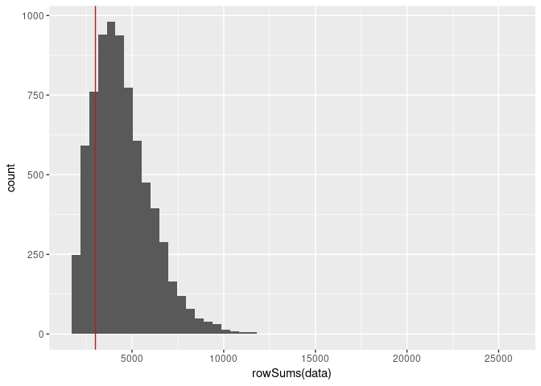
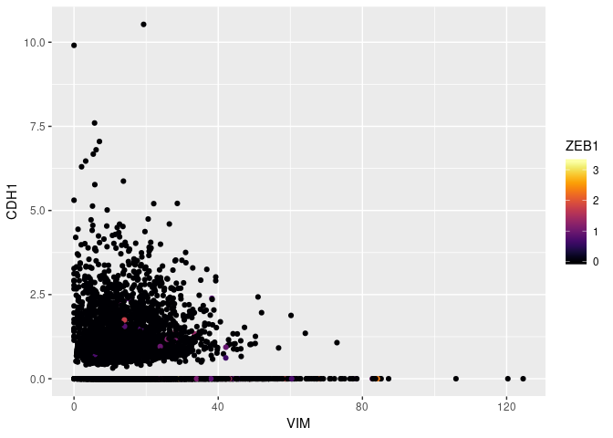
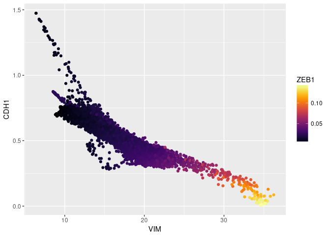
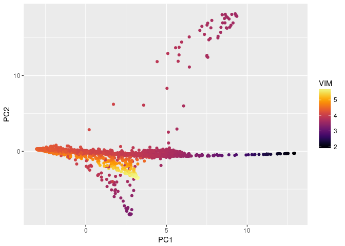
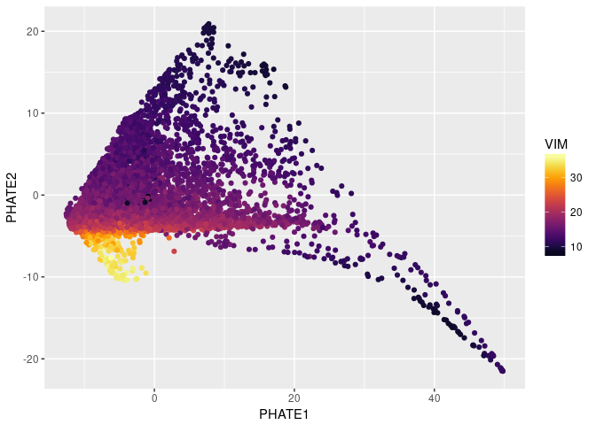

Rmagic EMT Tutorial
================

<!-- README.md is generated from README.Rmd. Please edit that file -->

## MAGIC (Markov Affinity-Based Graph Imputation of Cells)

  - MAGIC imputes missing data values on sparse data sets, restoring the
    structure of the data
  - It also proves dimensionality reduction and gene expression
    visualizations
  - MAGIC can be performed on a variety of datasets
  - Here, we show the effectiveness of MAGIC on
    epithelial-to-mesenchymal transition (EMT) data

Markov Affinity-based Graph Imputation of Cells (MAGIC) is an algorithm
for denoising and transcript recover of single cells applied to
single-cell RNA sequencing data, as described in Van Dijk D *et al.*
(2018), *Recovering Gene Interactions from Single-Cell Data Using Data
Diffusion*, Cell
<https://www.cell.com/cell/abstract/S0092-8674(18)30724-4>.

### Installation

To use MAGIC, you will need to install both the R and Python packages.

In R, run these commands to install MAGIC and all dependencies:

``` r
if (!require(devtools)) install.packages(devtools)
if (!require(Rmagic)) devtools::install_github("KrishnaswamyLab/magic/Rmagic")
```

In a terminal, run the following command to install the Python
repository.

``` bash
pip install --user git+git://github.com/KrishnaswamyLab/MAGIC.git#subdirectory=python
```

We’ll install a couple more tools for this tutorial.

``` r
if (!require(viridis)) install.packages("viridis")
if (!require(ggplot2)) install.packages("ggplot2")
if (!require(readr)) install.packages("readr")
if (!require(phateR)) install.packages("phateR")
```

If you have never used PHATE, you should also install PHATE from the
command line as follows:

``` bash
pip install --user phate
```

### Loading packages

We load the Rmagic package and a few others for convenience functions.

``` r
library(Rmagic)
```

    ## Loading required package: Matrix

``` r
library(readr)
library(ggplot2)
library(viridis)
```

    ## Loading required package: viridisLite

``` r
library(phateR)
```

    ##
    ## Attaching package: 'phateR'

    ## The following object is masked from 'package:Rmagic':
    ##
    ##     library.size.normalize

### Loading data

The example data is located in the MAGIC Github repository.

``` r
# load data
data <- read_csv("../../../data/HMLE_TGFb_day_8_10.csv.gz")
```

    ## Parsed with column specification:
    ## cols(
    ##   .default = col_integer()
    ## )

    ## See spec(...) for full column specifications.

``` r
data[1:5,1:10]
```

    ## # A tibble: 5 x 10
    ##   `5S_rRNA` `5_8S_rRNA`  A1BG `A1BG-AS1`   A2M `A2M-AS1` A2ML1 `A2ML1-AS1`
    ##       <int>       <int> <int>      <int> <int>     <int> <int>       <int>
    ## 1         0           0     0          0     0         0     0           0
    ## 2         0           0     0          0     0         0     0           0
    ## 3         0           0     0          0     0         0     0           0
    ## 4         0           0     0          0     0         0     0           0
    ## 5         0           0     0          0     0         0     0           0
    ## # ... with 2 more variables: A4GALT <int>, AAAS <int>

First, we need to remove lowly expressed genes and cells with small
library size.

``` r
# keep genes expressed in at least 10 cells
keep_cols <- colSums(data > 0) > 10
data <- data[,keep_cols]
# look at the distribution of library sizes
ggplot() +
  geom_histogram(aes(x=rowSums(data)), bins=50) +
  geom_vline(xintercept = 3000, color='red')
```

<!-- -->

``` r
# keep cells with at least 3000 UMIs and at most 15000
keep_rows <- rowSums(data) > 3000 & rowSums(data) < 15000
data <- data[keep_rows,]
```

We should library size normalize and transform the data prior to MAGIC.
Many people use a log transform, which requires adding a “pseudocount”
to avoid log(0). We square root instead, which has a similar form but
doesn’t suffer from instabilities at zero.

``` r
data <- library.size.normalize(data)
data <- sqrt(data)
```

### Running MAGIC

Running MAGIC is as simple as running the `magic` function. Because this
dataset is rather large, we can increase `k` from the default of 5 up to
15.

``` r
# run MAGIC
data_MAGIC <- magic(data, k=15, genes=c("VIM", "CDH1", "ZEB1"))
```

### Results

We can plot the data before and after MAGIC to visualize the results.

``` r
ggplot(data) +
  geom_point(aes(VIM, CDH1, colour=ZEB1)) +
  scale_colour_viridis(option="B")
```

<!-- -->

``` r
ggsave('EMT_data_R_before_magic.png', width=5, height=5)
```

``` r
ggplot(data_MAGIC) +
  geom_point(aes(VIM, CDH1, colour=ZEB1)) +
  scale_colour_viridis(option="B")
```

<!-- -->

``` r
ggsave('EMT_data_R_after_magic.png', width=5, height=5)
```

As you can see, the gene-gene relationships are much clearer after
MAGIC. We can look at the entire smoothed matrix with
`genes='all_genes'`, passing the original result to the argument `init`
to avoid recomputing intermediate steps. Note that this matrix may be
large and could take up a lot of memory.

``` r
data_MAGIC <- magic(data, k=15, genes="all_genes", init=data_MAGIC)
as.data.frame(data_MAGIC)[1:5, 1:10]
```

    ##          A1BG   A1BG-AS1       A2ML1     A4GALT      AAAS      AACS
    ## 1 0.001652799 0.03181386 0.008611862 0.01352016 0.1310461 0.2214583
    ## 2 0.001712522 0.03251830 0.010301061 0.01520513 0.1290344 0.2226633
    ## 3 0.001666287 0.03232608 0.010190187 0.01487386 0.1291938 0.2224736
    ## 4 0.001909803 0.03766258 0.029331208 0.02878727 0.1084993 0.2373691
    ## 5 0.001706013 0.03219870 0.009911144 0.01484650 0.1293207 0.2219350
    ##        AADAT     AAED1     AAGAB      AAK1
    ## 1 0.03053407 0.1472675 0.2744654 0.5680616
    ## 2 0.02966139 0.1476464 0.2729096 0.5690817
    ## 3 0.02996176 0.1469537 0.2727705 0.5709182
    ## 4 0.02529005 0.1420828 0.2591433 0.6070924
    ## 5 0.02984316 0.1473383 0.2727566 0.5681089

### Visualizing MAGIC values on PCA

We can visualize the results of MAGIC on PCA as follows.

``` r
gt <- reticulate::import("graphtools")
dat <- gt$base$Data(as.matrix(data_MAGIC$result), n_pca=2L)
data_MAGIC_PCA <- as.data.frame(dat$data_nu) # as.data.frame(prcomp(data_MAGIC)$x)
colnames(data_MAGIC_PCA) <- c("PC1", "PC2")
ggplot(data_MAGIC_PCA) +
  geom_point(aes(x=PC1, y=PC2, color=data_MAGIC$result$VIM)) +
  scale_color_viridis(option="B") +
  labs(color="VIM")
```

<!-- -->

``` r
ggsave('EMT_data_R_pca_colored_by_magic.png', width=5, height=5)
```

### Visualizing MAGIC values on PHATE

We can visualize the results of MAGIC on PHATE as follows.

``` r
data_PHATE <- phate(data, k=15)
ggplot(data_PHATE) +
  geom_point(aes(x=PHATE1, y=PHATE2, color=data_MAGIC$result$VIM)) +
  scale_color_viridis(option="B") +
  labs(color="VIM")
```

<!-- -->

``` r
ggsave('EMT_data_R_phate_colored_by_magic.png', width=5, height=5)
```
